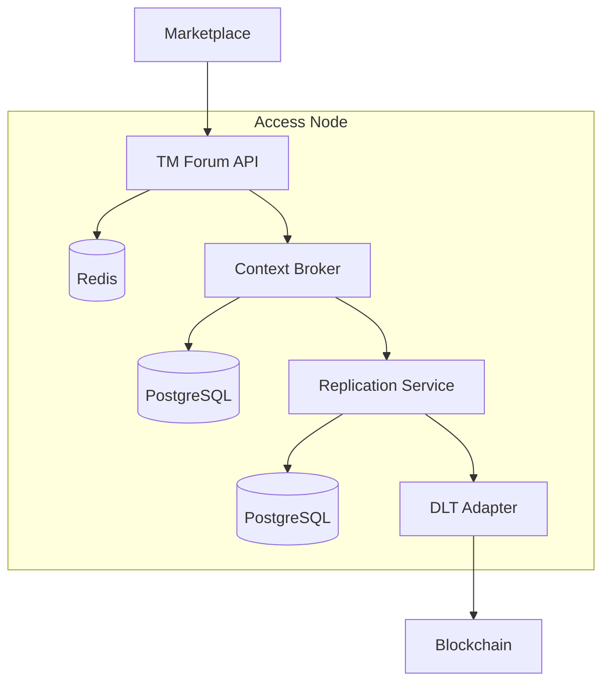
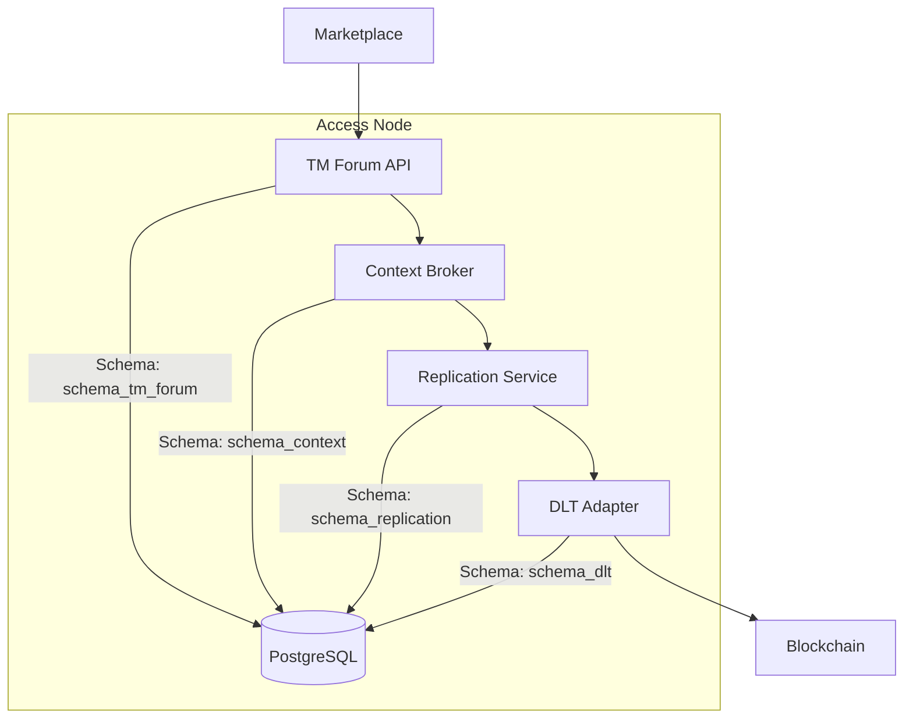

# Access Node Database Decision

## Status

> What is the status, such as proposed, accepted, rejected, deprecated, superseded, etc.?

The current status of this decision is **proposed**.

## Context

> What is the issue that we're seeing that is motivating this decision or change?

The current Access Node instance three databases. A Redis database for the TM Forum API component, a PostgreSQL for the Context Broker and a PostgreSQL for the Replication Service. Actually, the team in charge of developing the fourth component of the Access Node wants to implement its own database. If we consider the current architecture, we will have four different databases in the Access Node. This could lead to a more complex architecture and more difficult to maintain because each one implements a single instance of a database.

## Decision

> What is the change that we're proposing and/or doing?

We propose an approach to using a single database for all components of the Access Node. This approach will simplify the architecture and make it easier to maintain. Nevertheless, we need to consider that each component will need to implement its own schema in the database separating the responsibility of each component.

## Consequences

> What becomes easier or more difficult to do because of this change?

One of the difficulties could be that some of the current databases implement or have some bound configurations, and we will need to change the static configuration to external configuration. This could lead to a more complex configuration for the database. Nevertheless, we believe that the benefits of having a single database for all components outweigh the drawbacks.

